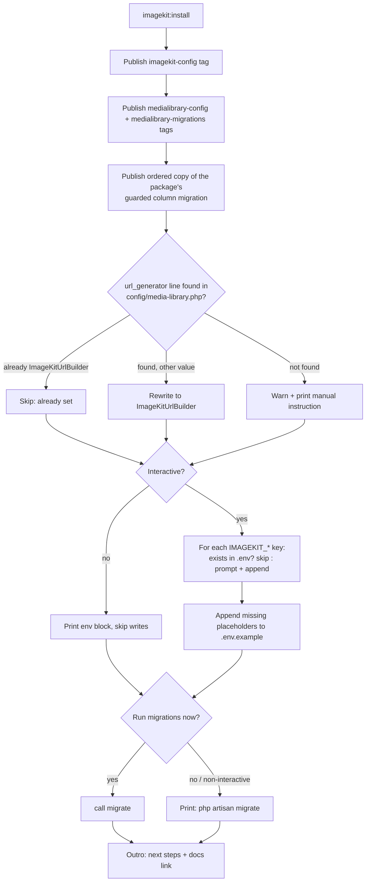

# feat: Add `imagekit:install` command for one-step setup

**Target repo:** thecyrilcril/laravel-imagekit (this repository)

---

## Goal Capsule

After `composer require thecyrilcril/laravel-imagekit`, a user runs a single command — `php artisan imagekit:install` — and both this package and spatie/laravel-medialibrary are fully set up: both configs published, the `media` table migration published, `config/media-library.php` pointed at `ImageKitUrlBuilder`, the `IMAGEKIT_*` env keys collected interactively and written to `.env` / `.env.example`, and migrations optionally run. The command is idempotent: re-running it on an already-installed app changes nothing and reports what it skipped.

---

## Product Contract

### Summary

Today the README documents four manual steps after `composer require`: publish the imagekit config, set four env keys, publish/point media-library's `url_generator` at the package's builder, and run migrations. Each step is a chance to stop halfway or typo a key name. The install command collapses them into one guided flow, matching the install UX users know from spatie/laravel-package-tools' `hasInstallCommand` (publish config, publish migrations, ask to run migrations) while adding the two steps package-tools cannot do: the `url_generator` rewrite and env scaffolding.

User-confirmed scope decisions:
- The command **auto-edits** the published `config/media-library.php` to set `url_generator` (with a printed-instruction fallback when the edit cannot apply).
- The command **prompts for credentials and writes them** to `.env` and `.env.example`, never overwriting existing values.
- The command **asks, then runs** `php artisan migrate` on confirmation.

### Requirements

- **R1 — One-step install.** `php artisan imagekit:install` performs every install step the README currently documents, in order, in one run.
- **R2 — Publish imagekit config.** The command publishes the `imagekit-config` tag (creates `config/imagekit.php` in the app).
- **R3 — Publish media-library assets.** The command publishes Spatie's `medialibrary-config` and `medialibrary-migrations` tags (note: no `laravel-` prefix — package-tools strips it), so `config/media-library.php` and the timestamped `create_media_table` migration land in the app.
- **R3b — Migration ordering on fresh apps.** The package's `add_imagekit_pending_deletion_to_media_table` migration gains a guard so it no-ops when the `media` table does not exist yet or the column is already present. The install command additionally publishes a copy of it timestamped one second after the published `create_media_table` migration, so a fresh app migrates in the correct order: create table, then add column. The vendor-loaded copy stays registered (existing consumers already ran it; the guard makes it harmless everywhere else).
- **R4 — Point the URL generator.** After publishing, the command rewrites the `'url_generator'` entry in the app's `config/media-library.php` to `\Thecyrilcril\ImageKit\ImageKitUrlBuilder::class` (the exact form the README documents). If the entry already points at the builder, the step no-ops with an "already set" note. If the expected line cannot be found, the command does not guess: it warns and prints the manual one-line instruction.
- **R5 — Env scaffolding.** The command prompts for `IMAGEKIT_PUBLIC_KEY`, `IMAGEKIT_PRIVATE_KEY` (masked input), `IMAGEKIT_URL_ENDPOINT`, and `IMAGEKIT_FOLDER` (defaulting to the app's slug or `uploads`). Answers are appended to `.env`; empty placeholders for the same keys are appended to `.env.example`. A key that already exists in either file is never overwritten — the prompt for it is skipped with a note. Each prompt can be left blank to skip.
- **R6 — Offer migrations.** The command ends by asking "Run the migrations now?" and calls `migrate` on yes. On no, it prints `php artisan migrate` as the remaining step.
- **R7 — Idempotent and non-interactive safe.** Re-running the command on an installed app is safe: publishes skip existing files (no `--force`), the config edit no-ops, existing env keys are left alone. With `--no-interaction`, prompts are skipped (nothing is written to `.env`, the printable env block is shown instead) and the migrate confirmation defaults to no.
- **R8 — Quality gate.** New code passes the full `composer ci` gate: Pint (final classes, strict types), PHPStan level 7, and the hard 100% coverage gate on the Laravel 13 CI leg.
- **R9 — Docs.** The README Installation section leads with the new command (manual steps retained as an alternative), and CHANGELOG gains an `### Added` entry in the house voice.

### Acceptance Examples

- **AE1 — Fresh app.** In a new Laravel app with the package required, running `imagekit:install` and answering all prompts leaves the app with: `config/imagekit.php`, `config/media-library.php` pointing at `ImageKitUrlBuilder`, a published `create_media_table` migration, four `IMAGEKIT_*` lines in `.env`, four placeholder lines in `.env.example`, and (after answering yes) a migrated `media` table with the `imagekit_pending_deletion_at` column.
- **AE2 — Re-run.** Running the command a second time completes successfully, reports each step as already done, and changes no file contents.
- **AE3 — Hand-edited config.** If someone replaced the `url_generator` line with a different single class-constant value, the rewrite still applies — but any shape the bounded pattern cannot match with certainty (line absent, comma-containing expression, function call) triggers the warn-and-print fallback, never a broken write.
- **AE4 — CI/non-interactive.** `imagekit:install --no-interaction` publishes everything, prints the env block, does not touch `.env`, does not migrate, and exits successfully.

### Scope Boundaries

**In scope:** the new command, a small env-file support class, provider registration, tests, README + CHANGELOG updates.

**Out of scope (true non-goals):**
- No changes to kitwire or any consuming app in this plan. (An earlier draft also froze the package's migration loading; that non-goal was dropped to fix the fresh-app ordering crash — see R3b.)
- No publishing of Spatie's views tag — the package never renders them.
- No "star the repo" prompt or telemetry.

**Deferred to follow-up work:**
- Adopting spatie/laravel-package-tools wholesale (would restructure the service provider for little gain now).
- Validating the entered credentials against the ImageKit API during install (nice touch, but adds a network dependency to install).

### Sources

- `README.md:16-43` — the manual install steps this command replaces, and the documented `url_generator` value.
- `src/ImageKitServiceProvider.php` — `runningInConsole()` block where the command registers, and the single `imagekit-config` publish tag.
- `src/Commands/ReconcileCommand.php` — house command conventions (signature style, `$this->components->*`, method injection, `SUCCESS`/`FAILURE`).
- `vendor/spatie/laravel-medialibrary/src/MediaLibraryServiceProvider.php` — package-tools provider generating the `medialibrary-config` / `medialibrary-migrations` tags (short name strips the `laravel-` prefix); migration ships as `create_media_table.php.stub` and is timestamped on publish.
- `config/imagekit.php` — reads six env keys in total; the install command prompts for four of them: `IMAGEKIT_PUBLIC_KEY`, `IMAGEKIT_PRIVATE_KEY`, `IMAGEKIT_URL_ENDPOINT` (no defaults) and `IMAGEKIT_FOLDER` (defaults to `uploads`). The two queue keys (`IMAGEKIT_QUEUE_CONNECTION`, `IMAGEKIT_QUEUE`) have working defaults and are deliberately not prompted.
- Laravel 13 console-tests docs — `expectsQuestion`, `expectsConfirmation`, `expectsOutputToContain`, `assertSuccessful`.

---

## Planning Contract

### Key Technical Decisions

- **KTD1 — Prompt through `Illuminate\Console\Command`, not bare `laravel/prompts` functions.** `$this->ask()`, `$this->secret()`, and `$this->confirm()` route through Laravel Prompts on Laravel 12/13, stay fully testable with `expectsQuestion`/`expectsConfirmation`, and add no composer constraint. Rejected: importing `Laravel\Prompts\text()` directly — `laravel/prompts` is not in `require`, so that would be an undeclared dependency; adding it buys nothing the Command methods don't already give.
- **KTD2 — Publish Spatie assets by tag, not by provider class.** Two `$this->call('vendor:publish', ['--tag' => ...])` calls for `medialibrary-config` and `medialibrary-migrations` (package-tools derives tags from the short name with the `laravel-` prefix stripped; the prefixed forms silently publish nothing). Rejected: `--provider="Spatie\MediaLibrary\MediaLibraryServiceProvider"` — it would also publish the views group, which this package never uses.
- **KTD3 — Single-line regex rewrite for `url_generator`, fail closed.** Match only a bounded single-token value — a `::class` constant or a quoted class-string, with no commas or parentheses — after `'url_generator' =>` in the app's published `config/media-library.php`, and replace it with `\Thecyrilcril\ImageKit\ImageKitUrlBuilder::class`. Every other shape (line absent, comma-containing expression, function call, restructured file) routes to the warn-and-print fallback; nothing is ever written on a partial match. If the value already contains `ImageKitUrlBuilder`, report "already set" and skip. Rejected: parsing the config as PHP and re-dumping it — loses comments and formatting, far riskier than a bounded string edit. Rejected: a greedy `[^,]+` value pattern — it truncates comma-containing expressions and would write back broken PHP, the one outcome "fail closed" forbids.
- **KTD4 — A dedicated `Support\EnvFile` class owns `.env` writing.** Final class, `File` facade for all reads/writes (house convention per `src/Support/MediaContents.php`), append-only semantics: `has(key)` checks for an existing `KEY=` line; `append(key, value)` adds a line, never edits existing ones. The command composes it for both `.env` and `.env.example`. Paths come from `base_path()`, so tests drive it against Testbench's skeleton (or a scratch base path). Rejected: inlining the file handling in the command — untestable in isolation and unreusable.
- **KTD5 — Idempotency by leaning on existing no-overwrite behavior.** `vendor:publish` without `--force` already skips existing files; the config edit and env writes carry their own already-done checks (KTD3, KTD4). The command therefore needs no `--force` flag in v1 and every step reports "done" or "skipped (already present)".
- **KTD6 — Fix fresh-app migration ordering with a guard plus an ordered published copy.** The migrator sorts by filename, so the vendor-dated `2026_08_18` column migration would run before a `create_media_table` migration published today. Two-part fix: (a) the package migration guards itself — it no-ops unless the `media` table exists and the column is absent; (b) the install command publishes a copy of it timestamped one second after the published `create_media_table`. Fresh apps migrate table-then-column; existing apps that already ran the vendor copy are untouched; re-publishing reuses the existing file the same way package-tools does. Rejected: renaming the published `create_media_table` to a date before `2026_08_18` — it rewrites a file whose naming Spatie's tooling owns, and every future package migration would hit the same trap again.

### Execution Order

U1 (env support class) → U2 (command skeleton + publishes + registration) → U3 (url_generator rewrite) → U4 (env prompting) → U5 (migrate step + finish output) → U6 (docs) → U7 (gate).

---

## High-Level Technical Design

The command is a straight pipeline with two confirm gates and per-step skip paths:

Directional guidance, not implementation specification: step order is fixed (publishes before the config edit, because the edit targets the file the publish just created), but helper method boundaries are the implementer's call.

---

## Implementation Units

### U1. `Support\EnvFile` append-only env writer

**Goal:** A small, fully tested class that answers "does this key exist?" and "append this key=value" for a given env file path.

**Requirements:** R5, R7.

**Dependencies:** none.

**Files:**
- `src/Support/EnvFile.php` (new)
- `tests/EnvFileTest.php` (new)

**Approach:** Final class constructed with a file path. `has(string $key): bool` matches a `KEY=` line at start-of-line (commented-out `# KEY=` lines do not count as present). `append(string $key, string $value): void` appends `KEY=value`, quoting the value when it contains spaces or `#`, ensuring a trailing newline exists before appending. `append()` rejects any value containing a newline or other control character (throws), so a single prompt answer can never introduce more than one line into the file — this is the injection guard for the whole install flow. A missing file makes `has()` return false and `append()` create the file. All I/O through the `File` facade.

**Patterns to follow:** `src/Support/MediaContents.php` (File facade with a why-docblock), `src/Support/FolderResolver.php` (final Support class shape).

**Test scenarios:**
- Happy path: `has()` is false on a fresh file, `append()` writes `IMAGEKIT_PUBLIC_KEY=abc`, `has()` is then true.
- Edge: file missing entirely — `has()` false, `append()` creates it.
- Edge: file exists without trailing newline — appended line is not glued to the previous one.
- Edge: `# IMAGEKIT_PUBLIC_KEY=old` commented line — `has()` still false.
- Edge: value containing a space or `#` is quoted.
- Security: a value containing a newline (or another control character) is rejected — nothing is written, and the file is unchanged.
- Negative: `append()` never modifies existing lines (file content before the appended line is byte-identical).

**Verification:** `vendor/bin/pest tests/EnvFileTest.php` green; class is `final`, strict types, PHPStan level 7 clean.

### U2. `InstallCommand` skeleton: publishes and registration

**Goal:** `imagekit:install` exists, publishes all three tags plus the ordered copy of the package's column migration, and reports each step.

**Requirements:** R1, R2, R3, R3b, R7.

**Dependencies:** none (parallel with U1).

**Files:**
- `src/Commands/InstallCommand.php` (new)
- `src/ImageKitServiceProvider.php` (add to the `commands([...])` array in the `runningInConsole()` block)
- `database/migrations/2026_08_18_000000_add_imagekit_pending_deletion_to_media_table.php` (add the KTD6 guard: no-op unless the `media` table exists and the column is absent)
- `tests/InstallCommandTest.php` (new)

**Approach:** Mirror `ReconcileCommand` conventions exactly: final class, string `$signature` (`imagekit:install`) and `$description` with `/** @var string */` docblocks, `$this->components->*` for output, `self::SUCCESS` return, a class-level why-docblock. Three `$this->call('vendor:publish', ['--tag' => ...])` invocations, then the KTD6 step: copy the package's column migration into the app's `database/migrations` with a timestamp one second after the published `create_media_table` file, reusing an existing `*_add_imagekit_pending_deletion_to_media_table.php` file when one is already there (mirrors package-tools' re-publish behavior). Later units add steps to `handle()`; keep each step a private method so coverage maps cleanly.

Test-infrastructure notes (both are load-bearing for this unit's scenarios): `InstallCommandTest` overrides the base `TestCase`'s migration setup so its assertions run against a genuinely empty schema — the shared base class pre-creates the `media` table, which would make the migrate-path assertions impossible. And the class uses Testbench's `InteractsWithPublishedFiles` concern (or an equivalent `afterEach`) to delete published configs, published migrations, and `.env` / `.env.example` from the shared skeleton after every test, so nothing leaks into other tests or later runs.

**Patterns to follow:** `src/Commands/ReconcileCommand.php` throughout.

**Test scenarios:**
- Happy path: running `imagekit:install` (answering the later prompts as they appear in U4/U5) exits successfully and the Testbench skeleton gains `config/imagekit.php`, `config/media-library.php`, a `*_create_media_table.php` migration, and a `*_add_imagekit_pending_deletion_to_media_table.php` migration whose timestamp sorts after the table migration's.
- Covers AE2 (partially): running twice exits successfully both times; second run duplicates neither published migration.
- Ordering: the guarded vendor copy of the column migration no-ops when the `media` table is absent, and no-ops when the column already exists.
- Registration: `Artisan::all()` contains `imagekit:install` (mirrors the existing service-provider test approach).

**Verification:** `vendor/bin/pest tests/InstallCommandTest.php` green; command listed by `php artisan list` in a Testbench context.

### U3. `url_generator` rewrite step

**Goal:** The published `config/media-library.php` points at the package's URL builder without manual editing.

**Requirements:** R4.

**Dependencies:** U2.

**Files:**
- `src/Commands/InstallCommand.php`
- `tests/InstallCommandTest.php`

**Approach:** KTD3. Read the app's `config_path('media-library.php')` via the `File` facade; apply the bounded regex replace; write back only when a change was made. Three outcomes, each with its own `components` line: rewritten, already set, not found (warn + print the manual one-liner from the README).

**Test scenarios:**
- Happy path: after install, the file contains `'url_generator' => \Thecyrilcril\ImageKit\ImageKitUrlBuilder::class,` and the rest of the file is unchanged.
- Covers AE3: a config whose `url_generator` points at a custom class gets rewritten; a config with the line deleted triggers the warning and prints the manual instruction, exit still successful.
- Idempotency: second run reports "already set" and the file's mtime-relevant content is unchanged.
- Edge: `config/media-library.php` missing entirely (publish failed or user deleted it) — warn-and-print fallback, no crash.

**Verification:** Test assertions on file content; grep-able check: `grep -n "ImageKitUrlBuilder::class" <skeleton>/config/media-library.php` after an install run.

### U4. Env prompting and writing step

**Goal:** Credentials collected interactively and scaffolded into `.env` / `.env.example` safely.

**Requirements:** R5, R7.

**Dependencies:** U1, U2.

**Files:**
- `src/Commands/InstallCommand.php`
- `tests/InstallCommandTest.php`

**Approach:** For each of the four keys: if `EnvFile::has()` on `.env`, note "already set" and skip the prompt; otherwise `$this->ask()` (or `$this->secret()` for the private key), and on a non-empty answer append to `.env`. `IMAGEKIT_FOLDER` prompt carries a sensible default. Afterwards, append any of the four keys missing from `.env.example` as empty placeholders. When input is non-interactive, skip all prompts and print the four-line env block for copy-paste. `.env` missing entirely (rare outside tests) follows the same non-interactive print path with a warning rather than creating the file.

**Test scenarios:**
- Happy path: `expectsQuestion` for each key, answers land in the skeleton `.env`, placeholders land in `.env.example`.
- Covers AE2: keys already in `.env` are not prompted for and not rewritten (byte-identical lines).
- Edge: blank answer to a prompt writes nothing for that key.
- Covers AE4: `--no-interaction` prints the env block (`expectsOutputToContain('IMAGEKIT_PUBLIC_KEY=')`) and `.env` is untouched.
- Edge: `.env` absent — warning printed, no file created, exit successful.

**Verification:** File-content assertions in tests; no test writes outside the Testbench skeleton / scratch base path.

### U5. Migrate confirmation and finish output

**Goal:** The flow ends with an optional migrate and a clear "what's next" outro.

**Requirements:** R6, R7.

**Dependencies:** U2.

**Files:**
- `src/Commands/InstallCommand.php`
- `tests/InstallCommandTest.php`

**Approach:** Branch on interactivity first — this guard is load-bearing, because Laravel's `confirm()` under `--no-interaction` does not skip, it silently returns the supplied default. When input is non-interactive, skip the confirmation entirely and print `php artisan migrate` as the remaining step. Only when interactive, ask `$this->confirm('Run the migrations now?', true)` — on yes, `$this->call('migrate')`; on no, print the remaining step. Outro lists what was done and points at the README's model-preparation section (the `->toImageKit()` step the command cannot do for the user).

**Test scenarios:**
- Covers AE1: confirming yes runs migrate — the skeleton database then has `media` with the `imagekit_pending_deletion_at` column (schema assertion).
- `expectsConfirmation(..., 'no')` — migrate not called (no `media` table), the printed next-step line appears, exit successful.
- Covers AE4: non-interactive run does not migrate.

**Verification:** Schema assertions via Testbench's sqlite `:memory:` connection.

### U6. Documentation

**Goal:** README leads with the one-step install; CHANGELOG announces the command.

**Requirements:** R9.

**Dependencies:** U2–U5 (documents final behavior).

**Files:**
- `README.md` (Installation section)
- `CHANGELOG.md`

**Approach:** Installation section becomes: `composer require` → `php artisan imagekit:install` → done, with the current manual steps collapsed into a "Manual installation" subsection kept intact for users who script their setup. CHANGELOG `### Added` entry in the house voice: bolded lead sentence, then consequence and rationale for an upgrader, mirroring the v0.1.0 `imagekit:reconcile` announcement shape (what it does, what it never overwrites, what it refuses to guess at).

**Test scenarios:** Test expectation: none — documentation-only unit.

**Verification:** README's Installation section names `imagekit:install` before any `vendor:publish` command; CHANGELOG has the entry under Unreleased.

### U7. Quality gate

**Goal:** The full CI gate stays green with the new surface at 100% coverage.

**Requirements:** R8.

**Dependencies:** U1–U5.

**Files:** none new (fixes land in the files above).

**Approach:** Run `composer ci` (Pint `--test`, PHPStan level 7, Pest with `--min=100`). Every branch of the command must be exercised: each prompt answered and skipped, both migrate answers, all three `url_generator` outcomes, non-interactive mode. Do not exclude files from coverage; do not lower the threshold.

**Test scenarios:** Test expectation: none — this unit verifies, it does not add behavior.

**Verification:** `composer ci` exits zero locally; CI matrix (PHP 8.3–8.5 × Laravel 12/13) green, coverage gate on the Laravel 13 leg.

---

## Verification Contract

- `composer ci` passes: Pint clean, PHPStan level 7 clean, 100% line coverage.
- `tests/InstallCommandTest.php` covers AE1–AE4 explicitly (each acceptance example maps to at least one test).
- Grep checks: `grep -rn "Laravel\\\\Prompts" src/` returns nothing (KTD1 held); `grep -n "InstallCommand::class" src/ImageKitServiceProvider.php` returns the registration.
- Manual smoke (optional, post-merge): in a throwaway Laravel app, `composer require` the branch and run `imagekit:install` end to end.

## Definition of Done

All seven units complete; `composer ci` green; README and CHANGELOG updated; no new composer dependencies; the command is idempotent per AE2 and non-interactive-safe per AE4.

---

## Risks

- **Spatie config drift.** A future media-library major could rename the `url_generator` key or restructure the config; KTD3's fail-closed fallback degrades this to a printed instruction instead of a broken file. Low likelihood on the pinned `^11.0`.
- **First file-writing tests in the suite.** No prior art for filesystem-writing tests here; the risk is tests leaking writes into the shared Testbench skeleton, where a leftover config or migration silently changes other tests' behavior. Mitigation: all paths derive from `base_path()` / `config_path()` under Testbench; `EnvFile` unit tests use a scratch directory cleaned up in `afterEach`; and `InstallCommandTest` uses Testbench's `InteractsWithPublishedFiles` concern (or an equivalent `afterEach`) to remove published configs, migrations, and `.env` / `.env.example` after every test (see U2).
- **Prompt testability on the CI matrix.** `expectsQuestion`/`expectsConfirmation` behavior must hold on both Laravel 12 and 13 legs; the Command-method route (KTD1) is the supported path on both, so this is low risk.
