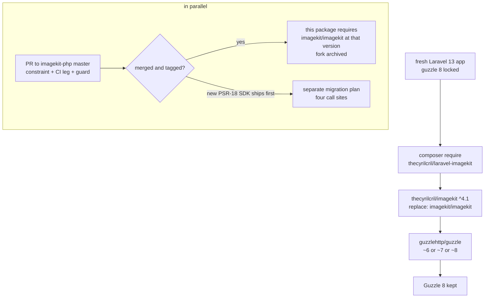

# Guzzle 8 Install via SDK Fork - Plan

> **Superseded 2026-08-28.** KTD-1 was reversed: the SDK is dropped in favour of a Laravel HTTP client package. See `docs/adr/0001-laravel-http-client-replaces-imagekit-sdk.md`. Kept for its research on upstream state and Guzzle 8.

**Target repos:**
- `imagekit-developer/imagekit-php` — upstream SDK; receives one pull request.
- `thecyrilcril/imagekit-php` — our fork of the SDK; the bridge until upstream ships.
- `thecyrilcril/laravel-imagekit` — this repository; switches its dependency, verifies, releases.

Paths below are repo-relative to the repo named in each unit.

---

## Goal Capsule

- **Objective:** `composer require thecyrilcril/laravel-imagekit` succeeds on a fresh Laravel 13 app with no flags and Guzzle 8 kept, while Laravel 12 apps on Guzzle 7 keep working.
- **Authority hierarchy:** this plan's Product Contract > Key Technical Decisions > unit Approach notes. Repo conventions (`composer ci`, 100% coverage gate on Laravel 13 legs, Pint, PHPStan) override unit detail where they conflict.
- **Execution profile:** three repos, sequential units with one parallel pair (U2 upstream PR and U3 fork publish share a commit). Live verification against a real ImageKit account is required, not optional.
- **Stop conditions:** stop and ask if the SDK test suite cannot be made green on Guzzle 8 with a guarded change of under ~30 lines; if Packagist refuses the fork name; if the live smoke test shows any of the four SDK calls behaving differently on Guzzle 8.
- **Tail ownership:** the implementer merges U4's PR, tags `v0.6.0`, and opens the U7 exit-path issue. Publishing the Packagist fork (U3) is a one-time manual step the implementer performs and records.

---

## Product Contract

### Summary

Publish a fork of the ImageKit PHP SDK that allows Guzzle 8, switch this package to it, and send the same one-line change upstream. Users then install this package on Laravel 13 without `-W`. When upstream merges or ships its new SDK, the fork is dropped.

### Problem Frame

This package depends on `imagekit/imagekit` 4.0.2, the official SDK. It requires `guzzlehttp/guzzle: ~6.0 || ~7.0`. Laravel 13 locks Guzzle 8 in every new app. Composer refuses the install unless the user passes `-W`, which downgrades Guzzle to 7. This is the first thing every new user hits, and the README currently documents the workaround.

This package cannot loosen another package's constraint. The change must land in the SDK. Upstream `master` last moved in September 2024. Upstream is building a new generated SDK on its `next` branch (PSR-18, PHP 8.1+, no Guzzle pin), but it is not on Packagist and its release PR was closed unmerged. Waiting is not a plan.

### Requirements

**Install**
- R1. `composer require thecyrilcril/laravel-imagekit` succeeds on a fresh Laravel 13 app with Guzzle 8 locked, with no flags, and Guzzle stays on 8.x.
- R2. The same install succeeds on a Laravel 12 app with Guzzle 7 locked.
- R3. Users of this package change no code; the `ImageKit\ImageKit` namespace and class names are unchanged.

**SDK correctness**
- R4. The SDK's own test suite passes on Guzzle 7 and Guzzle 8, on PHP 8.3, 8.4 and 8.5.
- R5. The four SDK calls this package uses — `uploadFile()`, `deleteFile()`, `listFiles()`, `url()` — behave the same on Guzzle 8 as on Guzzle 7 against a real ImageKit account.
- R6. An unreachable ImageKit host makes `uploadNow()` return `null` and log, on Guzzle 8 as on Guzzle 7; no exception escapes from inside the SDK.

**Upstream and exit**
- R7. An upstream pull request is open that contains only the constraint change, a CI leg for Guzzle 8, and the code fixes Guzzle 8 forces; no supported version is dropped.
- R8. A written exit path exists: when upstream merges, or the new SDK lands on Packagist, this package drops the fork with a one-file change.

**Quality gates**
- R9. This package's CI proves both Guzzle 7 and Guzzle 8 on every PHP × Laravel leg it already runs; the 100% coverage gate on Laravel 13 legs stays.

### Acceptance Examples

- AE1. **Covers R1.** Given `laravel new app` on Laravel 13.29 (Guzzle 8.1 locked), when `composer require thecyrilcril/laravel-imagekit` runs, then it installs, `composer show guzzlehttp/guzzle` reports 8.x, and `php artisan imagekit:install` runs.
- AE2. **Covers R2.** Given a Laravel 12 app (Guzzle 7 locked), when the same command runs, then it installs and Guzzle stays on 7.x.
- AE3. **Covers R5.** Given the test app at `~/Code/imagekit-livewire-test` on Guzzle 8, when a 3000×2000 PNG is uploaded to the `avatar` collection with `await: true`, then `getUrl()` returns an `ik.imagekit.io` URL that answers HTTP 200, the `avatar` preset URL carries `w-200,h-200`, and `imagekit:reconcile` inspects 1 file.
- AE4. **Covers R6.** Given `api.imagekit.io` resolves to `127.0.0.1` via `/etc/hosts`, when `ImageKit::uploadNow()` runs, then it returns `null`, logs one error, and a retry job is queued.
- AE5. **Covers R8.** Given upstream tags a release containing the constraint change, when `composer.json` is switched back to `imagekit/imagekit` at that version, then `composer ci` is green with no other change.

### Scope Boundaries

- In scope: the SDK constraint, SDK CI, and whatever Guzzle 8 / PSR-7 3.x strictness breaks in `src/ImageKit/Resource/GuzzleHttpWrapper.php`; this package's dependency, CI, README, changelog and release.
- Out of scope: migrating to upstream's `next` SDK (different API, unreleased) — tracked in the exit path only.
- Out of scope: replacing the SDK with Laravel's `Http` client; that alternative was rejected (see KTD-1).
- Out of scope: other SDK cleanup (dropping PHP 5.6, `beberlei/assert` bump) unless SDK CI on PHP 8.x fails without it.

### Deferred to Follow-Up Work

- A contract seam for the four SDK calls inside this package, so the future switch to upstream's PSR-18 SDK touches one adapter. Not needed for this change; noted in the U7 issue.

### Sources

- Upstream repo: https://github.com/imagekit-developer/imagekit-php — `master` = 4.0.2 (last commit 2024-09-05); `next` / `generated` = PSR-18 SDK, `php ^8.1`, `php-http/discovery`; release-please PR #69 closed 2026-05-23.
- Prior closed upstream PR on the same theme: imagekit-developer/imagekit-php#23 (2020).
- Guzzle 8 upgrade guide: https://github.com/guzzle/guzzle/blob/8.0.0/UPGRADING.md — requires PHP ^7.4 || ^8.0, Promises 3.x, PSR-7 3.x; stricter header values and request options; changed network-exception classification.
- Guzzle PSR-7 3.x upgrade guide: https://github.com/guzzle/psr7/blob/3.0/UPGRADING.md
- Composer `replace`: https://getcomposer.org/doc/04-schema.md#replace
- Live evidence of the failure: this repo, README "Installation" (`-W` note added in v0.5.1); Composer error text recorded in CHANGELOG v0.5.1.
- SDK call sites in this repo: `src/ImageKitUploader.php` (`uploadFile`), `src/ImageKitFileRemover.php` (`deleteFile`), `src/Commands/ReconcileCommand.php` (`listFiles`), `src/Support/UrlFactory.php` (`url`); binding in `src/ImageKitServiceProvider.php`.

---

## Planning Contract

### Key Technical Decisions

- **KTD-1. Fork the SDK rather than replace it with a Laravel `Http` adapter.** A fork is a one-line change plus a Packagist listing, and it keeps the exit path trivial (swap one `require` back). An in-package adapter would re-implement URL building (about 60 transformation key mappings) and change seven test files. Rejected alternative: adapter. Revisit only if upstream is still silent when the new SDK ships.
- **KTD-2. Publish the fork on Packagist as `thecyrilcril/imagekit` with `"replace": {"imagekit/imagekit": "self.version"}`.** An app cannot inherit a `repositories` entry from a package, so a VCS-only fork would push setup onto every user. `replace` lets any other package that requires `imagekit/imagekit ^4` be satisfied by the fork.
- **KTD-3. Fork version `4.1.0`.** It satisfies `^4.0.2`, signals "same API, one additive change", and leaves `4.0.x` to upstream. Risk of collision with a future upstream `4.1.0` is accepted; the exit path swaps the package name, not just the version.
- **KTD-4. Constraint becomes `~6.0 || ~7.0 || ~8.0` in both the PR and the fork.** Nothing is dropped, so upstream has no compatibility reason to refuse.
- **KTD-5. Namespace and class names are untouched.** Only `composer.json` `name`, `require`, `replace` and `description` change in the fork. This package's `src/` does not change (R3).
- **KTD-6. Wrapper changes are guarded, not rewritten.** Guzzle 8 tightens PSR-7 (status codes 100–599, string header values) and reclassifies some network exceptions. Change `GuzzleHttpWrapper` only where U1 shows a test or live failure, with a test per change, so the upstream diff stays reviewable.
- **KTD-7. This package's CI proves Guzzle 7 and 8 explicitly.** A `guzzle` matrix dimension is added rather than relying on which version Laravel 12 vs 13 happens to resolve, because that resolution can change under us.

### High-Level Technical Design

### Assumptions

- Guzzle 8 does not change the request/response contract the wrapper depends on beyond the PSR-7 strictness and exception classification named in the upgrade guide. U1 verifies.
- Packagist accepts the name `thecyrilcril/imagekit`; the `laravel-` prefix already distinguishes this package.
- The ImageKit account used for the live test (`~/Code/imagekit-livewire-test`, folder `imagekit-livewire-test`) stays available.

### Sequencing

U1 → U2 + U3 (same commit, U3 does not wait for U2 to merge) → U4 → U5 → U6 → U7.

---

## Implementation Units

### U1. Prove the SDK on Guzzle 8

- **Goal:** the SDK's test suite is green on Guzzle 7 and Guzzle 8 on PHP 8.3–8.5, with the smallest guarded change, and this package's suite is green against it.
- **Requirements:** R4, R6
- **Dependencies:** none
- **Files (fork clone, `~/Code/imagekit-php`):** `composer.json`; `src/ImageKit/Resource/GuzzleHttpWrapper.php` (only if a failure demands it); `tests/ImageKit/` (new test per guard).
- **Files (this repo, uncommitted scratch only):** `composer.json` with a temporary `path` repository pointing at the clone.
- **Approach:** fork and clone upstream; branch `guzzle-8`. Widen the constraint. Resolve Guzzle 8 locally despite the SDK's `config.platform.php: 5.6` (ignore the platform requirement for the local run rather than editing it, to keep the upstream diff minimal). Run the SDK suite on Guzzle 8, then on Guzzle 7. For each failure, add a failing test first, then the smallest guard. Two known suspects: `handleRequestException` building a PSR-7 `Response` with a status of 0 when no response exists; non-string header values.
- **Execution note:** test-first for each guard; the failing SDK test is the evidence that the guard is needed at all.
- **Patterns to follow:** existing SDK tests under `tests/ImageKit/` use a mocked Guzzle client via `MockHandler`; mirror that shape.
- **Test scenarios:**
  - SDK suite on Guzzle 8.x, PHP 8.3, 8.4, 8.5: all green.
  - SDK suite on Guzzle 7.x, same PHP versions: all green (no regression).
  - Connection failure with no response (mock handler throws a connect-type exception): the wrapper returns a response the SDK can read, or throws the SDK's own network error — the same outcome on Guzzle 7 and 8.
  - HTTP 4xx with a JSON body: `error.message` is surfaced as before.
  - Multipart upload with string contents, and with a resource: request body is built without a type error.
  - This package: `vendor/bin/pest` against the clone via a `path` repository: 251+ passed.
- **Verification:** both SDK runs green; this package's suite green against the clone; the list of guards (possibly empty) recorded for U2.

### U2. Open the upstream pull request

- **Goal:** upstream has a minimal, green, reviewable PR.
- **Requirements:** R7
- **Dependencies:** U1
- **Files (`imagekit-developer/imagekit-php`, head `thecyrilcril:guzzle-8`):** `composer.json`; `.github/workflows/test.yml`; the U1 guard and its test if any.
- **Approach:** one commit. Constraint to `~6.0 || ~7.0 || ~8.0`. In `test.yml`, add PHP 8.1–8.4 to the existing matrix and one extra job that pins Guzzle `^8` on PHP 8.3 before running PHPUnit; leave the 5.6–8.0 legs untouched. PR body: the exact Composer error from a Laravel 13 app, what changed, a link to green Actions on the fork, and a sentence that no supported version was dropped.
- **Patterns to follow:** the closed PR #23 shows what upstream did not merge (a constraint-only change in 2020); include CI evidence this time.
- **Test scenarios:** `Test expectation: none -- this unit is a PR submission; its evidence is U1's green suites and the fork's Actions run.`
- **Verification:** PR is open; fork Actions green on all legs including the Guzzle 8 job; PR URL recorded in this plan's Sources.

### U3. Publish the fork on Packagist

- **Goal:** `thecyrilcril/imagekit` 4.1.0 is installable from Packagist and satisfies `imagekit/imagekit ^4.0.2`.
- **Requirements:** R1, R2, R3
- **Dependencies:** U1 (shares U2's commit; does not wait for U2's merge)
- **Files (`thecyrilcril/imagekit-php`, branch `main`):** `composer.json` (`name`, `replace`, `description`); `README.md` (three-line banner at the top).
- **Approach:** one fork-only commit on top of `guzzle-8`: rename to `thecyrilcril/imagekit`, add `"replace": {"imagekit/imagekit": "self.version"}`, set the description to name the upstream PR. Tag `v4.1.0`. Submit to Packagist; enable the GitHub auto-update hook.
- **Test scenarios:**
  - Packagist metadata for `thecyrilcril/imagekit` lists `4.1.0` with the widened constraint and the `replace` block.
  - A scratch Laravel 13 app (Guzzle 8 locked): `composer require thecyrilcril/imagekit` installs with Guzzle 8 kept.
  - A scratch app that already has `imagekit/imagekit` installed: requiring the fork replaces it without a conflict error.
- **Verification:** the three scenarios above pass; the Packagist page shows the auto-update hook active.

### U4. Switch this package to the fork and add Guzzle CI legs

- **Goal:** this package depends on the fork, and CI proves Guzzle 7 and 8 on every leg.
- **Requirements:** R1, R2, R3, R9
- **Dependencies:** U3
- **Files:** `composer.json`; `composer.lock`; `.github/workflows/ci.yml`; `tests/TestCase.php` (only if the binding needs a test-time adjustment; expected: none).
- **Approach:** replace `imagekit/imagekit ^4.0.2` with `thecyrilcril/imagekit ^4.1`. Confirm `vendor/imagekit/imagekit` is gone and `src/` needs no edit. In `ci.yml`, add a `guzzle: ['^7.8', '^8.0']` matrix dimension applied with a `--no-update` require before `composer update`, in the same step that pins `illuminate/support`. Keep the coverage gate on Laravel 13 legs only. Leave the `without-image-driver` job on the default Guzzle resolution.
- **Patterns to follow:** the existing `Install dependencies` step in `ci.yml` already pins `illuminate/support` by matrix; add the Guzzle pin beside it.
- **Test scenarios:**
  - `composer ci` on Laravel 13 × Guzzle 8: green with 100% coverage.
  - `composer ci` on Laravel 13 × Guzzle 7: green with 100% coverage.
  - `composer ci:no-coverage-gate` on Laravel 12 × Guzzle 7 and × Guzzle 8: green.
  - `ImageKit::fake()` still swaps the `ImageKitClient` binding (existing tests in `tests/ImageKitClientTest.php` pass unchanged).
  - `vendor/imagekit/imagekit` does not exist after `composer update`; `vendor/thecyrilcril/imagekit` does.
- **Verification:** every CI leg green, including both Guzzle values; Pint and PHPStan clean; `src/` diff is empty.

### U5. Live verification in the test app

- **Goal:** the four SDK calls and the outage path behave the same on Guzzle 8 against a real ImageKit account.
- **Requirements:** R5, R6
- **Dependencies:** U4
- **Files (`~/Code/imagekit-livewire-test`):** `composer.json` (temporary `vcs` repository for the U4 branch); `/etc/hosts` (temporary line for AE4); `tests/Feature/AvatarUploadTest.php` (exists; unchanged).
- **Approach:** remove the package, restore Guzzle 8, require the U4 branch with no `-W`. Confirm Guzzle 8. Run the same smoke sequence used on 2026-08-27 for v0.5.x. Then the outage path. Then the app's own test suite.
- **Execution note:** smoke-first; this unit is runtime proof, not unit coverage.
- **Test scenarios:**
  - **Covers AE3.** Upload 3000×2000 PNG with `await: true`: `getUrl()` returns an `ik.imagekit.io` URL; `curl` gets HTTP 200; `isReady()` is true.
  - `$media->getUrl('avatar')` carries `w-200,h-200,fo-face`.
  - Second upload to the `singleFile()` collection: old media row gone; after `queue:work --queue=imagekit --stop-when-empty` the old remote file is gone (checked via `listFiles`).
  - `imagekit:reconcile`: inspects 1 file, reports no orphans; after a raw SQL delete of the media row it lists 1 orphan.
  - **Covers AE4.** Hosts-file block: `uploadNow()` returns `null`, one log line, one `RemoveFileFromImageKit`-free retry job queued; hosts line removed afterwards.
  - `php artisan test`: 34 passed.
- **Verification:** each scenario's observed output pasted into U4's PR body.

### U6. Documentation and release v0.6.0

- **Goal:** users see no `-W`, understand the fork in one paragraph, and get a tagged release.
- **Requirements:** R1, R3
- **Dependencies:** U5
- **Files:** `README.md`; `CHANGELOG.md`.
- **Approach:** README "Installation": remove the `-W` line and its explanation. Add a short "Dependencies" note: the package depends on `thecyrilcril/imagekit`, a fork of `imagekit/imagekit` that only adds Guzzle 8 support, with the upstream PR link, and that it goes away when upstream ships. CHANGELOG `v0.6.0` → **Changed**: dependency switched to the fork; installs on Laravel 13 without `-W`; link the PR. Merge U4's PR, tag `v0.6.0`, create the GitHub release.
- **Test scenarios:** `Test expectation: none -- documentation and release; proven by AE1 against the published version.`
- **Verification:** **Covers AE1.** A fresh `laravel new` + `composer require thecyrilcril/laravel-imagekit` (release version from Packagist, no flags) installs with Guzzle 8 kept and `imagekit:install` runs.

### U7. Exit path issue

- **Goal:** the fork has a written end.
- **Requirements:** R8
- **Dependencies:** U6
- **Files:** none in-repo; one GitHub issue on `thecyrilcril/laravel-imagekit` titled "Drop the imagekit SDK fork".
- **Approach:** issue body names two triggers, either closes it: (1) upstream merges the PR and tags a release → switch `composer.json` back to `imagekit/imagekit` at that version, bump this package, archive the fork with a README pointer; (2) upstream publishes the `next` SDK on Packagist → open a separate plan to migrate the four call sites, and consider the deferred contract seam first. Add a reminder to check on 2026-09-27.
- **Test scenarios:** `Test expectation: none -- tracking artifact.`
- **Verification:** **Covers AE5** when trigger (1) fires. Issue exists with both triggers and the date.

---

## Verification Contract

| Gate | Where | Command / evidence | Pass condition |
|---|---|---|---|
| SDK on Guzzle 8 | fork clone | `vendor/bin/phpunit` with Guzzle 8.x, PHP 8.3 / 8.4 / 8.5 | green |
| SDK on Guzzle 7 | fork clone | same, Guzzle 7.x | green |
| Package suite | this repo | `composer ci` (Pint, PHPStan, Pest with `--min=100`) | green, 100% |
| Package CI | this repo | matrix PHP 8.3–8.5 × Laravel 12/13 × Guzzle ^7.8/^8.0, plus `without-image-driver` | all legs green |
| Fresh install | scratch app | `laravel new` + `composer require thecyrilcril/laravel-imagekit` | no `-W`; Guzzle stays 8.x |
| Live | `~/Code/imagekit-livewire-test` | U5 smoke sequence | upload 200, preset URL, delete, reconcile finds 1 file |
| Outage | same | hosts-file block + `uploadNow()` | returns `null`; no exception |
| Upstream | GitHub | PR URL | open; fork Actions green |
| Packagist | packagist.org | `thecyrilcril/imagekit` | `4.1.0` listed with `replace` |

---

## Definition of Done

**Global**
- R1–R9 each traced to a green gate above.
- `src/` in this repo has no diff from the dependency switch (R3).
- README carries no `-W` instruction; CHANGELOG has `v0.6.0`; tag and GitHub release exist.
- Upstream PR open with a link recorded in Sources; exit-path issue open.
- No scratch changes left behind: the temporary `path`/`vcs` repository entries, the `/etc/hosts` line, and any local-only SDK branch edits are removed.

**Per unit**
- U1: both SDK suites green; guard list recorded.
- U2: PR open, fork Actions green.
- U3: Packagist lists 4.1.0; scratch install keeps Guzzle 8.
- U4: all CI legs green; `vendor/imagekit/imagekit` absent.
- U5: every scenario observed and pasted into the PR.
- U6: release published; AE1 passes against Packagist.
- U7: issue open with two triggers and a date.

---

## Open Questions

**Resolved during planning**
- Whether to replace the SDK instead of forking: no (KTD-1).
- Where to publish the fork: Packagist with `replace` (KTD-2).

**Deferred to implementation**
- Which, if any, wrapper guards Guzzle 8 actually needs. U1 decides from failing tests; the plan names two suspects only.
- Whether `beberlei/assert ^2.9.9` emits deprecations on PHP 8.5 in the SDK suite. If it does, bump to `^2.9.9 || ^3.3` in the same PR and say why.

---

## Risks

| Risk | Mitigation |
|---|---|
| Upstream never merges | The fork is permanent until the new SDK ships; cost is one `composer.json` line in one repo. |
| Guzzle 8 breaks an SDK method this package does not use | U5 proves the four calls this package makes; the PR body states that scope. |
| A future upstream `4.1.0` collides with the fork's version | The exit path swaps the package name, not only the version; `replace: self.version` keeps Composer's view consistent. |
| Packagist name collision or refusal | Fall back to `thecyrilcril/imagekit-php`; the name is not load-bearing. |
| Two environments of the live test share the ImageKit folder | The test app uses its own root folder `imagekit-livewire-test`; reconcile is scoped to it. |
